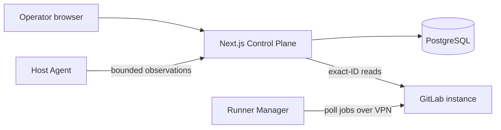

# GitLab Runner Platform

Deploy, observe, and operate isolated project-scoped GitLab Runners on Arch
Linux.

GitLab Runner Platform combines rootless Podman Runner managers, systemd user
services, an unprivileged Host Agent, and a Next.js Control Plane backed by
PostgreSQL. The UI displays only persisted GitLab and Host observations;
missing evidence remains `unknown` or `no data`.

> [!IMPORTANT]
> The browser UI is read-only and has no application login. It binds to
> loopback by default. Cross-host access requires trusted networking or a
> reverse proxy with verified HTTPS.

## Overview



The platform currently provides:

- frontend and .NET Runner Templates with separate Linux users, services,
  containers, credentials, caches, tags, and image policies;
- rootless Podman Runner managers managed by systemd user Quadlets;
- manager host networking for access through an externally managed VPN;
- isolated per-build job networks with privileged mode disabled and no Podman
  socket exposed to jobs;
- a standard-library Python Host Agent installed in a per-user `.venv`;
- exact-ID GitLab monitoring with an installed `read_api` credential;
- an operator CLI that creates an allowlisted, initially paused Project Runner
  and deploys its isolated Runner Stack.

The Control Plane does not replace GitLab's job interface and does not expose
Runner lifecycle mutations in the browser. See the
[product specification](docs/spec.md) for target behavior and
[domain context](docs/context.md) for canonical terms.

## Supported Runner Templates

| Template | Tags | Guide |
| --- | --- | --- |
| `gitlab-runners/frontend` | `frontend`, `podman` | [Frontend Runner](stacks/gitlab-runners/frontend/README.md) |
| `gitlab-runners/dotnet` | `dotnet`, `podman` | [.NET Runner](stacks/gitlab-runners/dotnet/README.md) |

Only project-scoped Runners are supported by the current provisioning flow.
Every Runner Stack uses its own trust boundary and keeps concurrency at one.

## Requirements

### Runner Host

- Arch Linux with cgroup v2 and interactive sudo;
- an externally managed VPN that can reach GitLab through verified HTTPS;
- working Host and container DNS for the GitLab hostname;
- enough CPU, memory, and storage for each isolated Runner Stack.

Host bootstrap performs a full Arch package upgrade and requires a reboot.
Automation validates the VPN but never configures or reconnects it.

### Development and Control Plane

- Node.js `22.17.x`, selected through nvm;
- pnpm `10.34.5`, selected through Corepack;
- PostgreSQL;
- Python `3.14` and uv for Python and infrastructure development;
- a GitLab token with `read_api` for monitoring;
- a separate token with `create_runner` only when Project provisioning is
  required.

## Developer setup

Install the pinned dependencies:

```bash
nvm install
nvm use
corepack enable
pnpm install --frozen-lockfile
uv sync --locked
```

Configure the Control Plane and apply the database migration:

```bash
cp apps/web/.env.example apps/web/.env
$EDITOR apps/web/.env
pnpm db:deploy
pnpm db:status
```

Install the monitoring credential through stdin. Tokens do not belong in
`.env` or PostgreSQL.

```bash
read -rs GITLAB_READ_API_TOKEN
printf '%s' "${GITLAB_READ_API_TOKEN}" | \
  pnpm gitlab:credential:install -- --purpose monitoring
unset GITLAB_READ_API_TOKEN
```

Start the development server:

```bash
pnpm dev
```

Open <http://127.0.0.1:3000>. The supervisor synchronizes GitLab before
opening the listener, continues periodic synchronization, and exits cleanly
on one `Ctrl-C`.

For a production build:

```bash
pnpm web:build
pnpm start
```

Database, credential, Host Agent, discovery, and provisioning procedures are
documented in [Control Plane operations](docs/control-plane.md).

## Common workflows

Use canonical Stack names, never caller-supplied filesystem paths:

```bash
STACK=gitlab-runners/frontend
```

| Goal | Command |
| --- | --- |
| Validate one Stack | `make validate STACK="${STACK}"` |
| Run read-only Host preflight | `make check STACK="${STACK}"` |
| Install or reconcile a Runner Stack | `make install STACK="${STACK}"` |
| Verify an installed Runner Stack | `make verify STACK="${STACK}"` |
| Install or rotate its Host Agent | `pnpm host:bootstrap-agent --stack "${STACK}"` |
| Synchronize GitLab once | `pnpm gitlab:sync` |
| Provision an allowlisted Project Runner | `pnpm runner:provision -- --project namespace/project --template "${STACK}"` |

Host installation, registration, provisioning, and uninstall change local or
GitLab state. Review [Getting started](docs/getting-started.md) before running
them. Uninstall permanently removes the local Runner user and data but never
deletes or unregisters the GitLab Runner Record.

## Validation

Run the narrowest relevant check first, then the corresponding full check:

| Change | Validation |
| --- | --- |
| Web, contracts, or domain | focused Vitest file, then `pnpm validate:web` |
| Host Agent | focused unittest, then `make test-agent` and `pnpm validate:web` |
| One Stack configuration | `make validate STACK="${STACK}"`, then `make validate-all` |
| Shell, YAML, Ansible, or security boundary | `make lint`, then `make validate-all` |
| DNS or Runner configuration | `./tests/test-vpn-dns.sh`, then `make validate-all` |

Always finish with:

```bash
git diff --check
```

## Repository layout

```text
agent/        Read-only Python Host Agent and systemd user units
apps/web/     Next.js UI, tRPC API, Prisma, connectors, and provisioning worker
packages/     Versioned contracts and domain rules
playbooks/    Ansible entry points
roles/        Shared Host and Runner automation
stacks/       Supported Runner Templates, examples, and smoke pipelines
scripts/      Fixed operator workflows
tests/        Repository, infrastructure, and security validation
docs/         Architecture, operations, security, and development guides
```

## Documentation

- [Documentation index](docs/README.md)
- [Getting started](docs/getting-started.md)
- [Architecture](docs/architecture.md)
- [Security model](docs/security.md)
- [Development workflow](docs/development-workflow.md)
- [Troubleshooting](docs/troubleshooting.md)
- [Adding a Runner Stack](docs/adding-a-runner-stack.md)
- [Product specification](docs/spec.md)
- [Domain context](docs/context.md)

Executable code and tests define current behavior. The specification may
include capabilities that have not been implemented yet.
