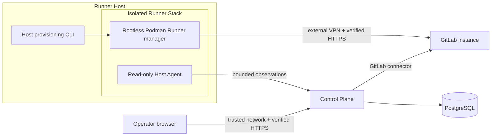

# Architecture

## Topology



GitLab initiates no inbound Runner Host connection. Runner managers poll
GitLab over Host networking to use the externally managed VPN. CI jobs receive
isolated per-build networks and never receive Host networking or the Podman
socket. The initial deployment may colocate the Control Plane and Runner Host,
but their component boundaries do not depend on that topology.

## Control Plane data flow

```text
Host Agent -- scoped v1 observations --> PostgreSQL
GitLab connector -- exact-ID reads ----> PostgreSQL
                                             |
                                             v
                               domain freshness + health
                                             |
                                             v
                                  tRPC --> Next.js pages
```

`packages/contracts` owns versioned boundary schemas.
`packages/domain` evaluates health and freshness without fabricating unknown
values. `apps/web` owns transport, Prisma persistence, GitLab adapters, and UI.

The Web runtime has only the PostgreSQL fleet repository. Missing inventory is
rendered as no data. Host and GitLab observations are immutable, independently
timestamped, and independently stale.

Prisma exposes idiomatic TypeScript model and field names. Its database maps
use plural snake_case table names and snake_case columns, enums, indexes, and
constraints. The single base migration represents a new empty deployment and
installs the approved frontend and .NET Runner Template revisions.

## Server lifecycle

The start supervisor completes one GitLab synchronization before opening the
Next.js listener, then runs serial synchronization until shutdown. A
target-specific GitLab failure preserves earlier evidence; missing credentials,
invalid configuration, or database failure stop startup.

Host checks never run inside Next.js. Each Agent polls a credential-scoped
refresh decision every five seconds. The server requests a report when Host
evidence is missing or stale and, by default, once after every Control Plane
start. The browser refreshes visible pages every ten seconds.

## Host Agent

One Agent belongs to one Runner user and one Runner Stack. It runs from a
package-free per-user `.venv` with Python isolated mode and reports fixed
checks for VPN, DNS, TLS, systemd, Podman socket presence, Runner manager,
Runner config metadata, and GitLab HTTPS connectivity.

The Agent:

- reads its scoped credential from a fixed `0600` file;
- keeps at most one bounded pending observation in a `0700` state directory;
- retries the same delivery ID before collecting again;
- discards an outbox entry when re-enrollment changes its Host or Stack
  identity;
- never opens the Podman socket or reads `config.toml` contents;
- cannot receive commands, paths, or Operations.

## Runner Stack runtime

Stack configuration feeds one shared Ansible playbook:

```text
stacks/gitlab-runners/<workload>/config.yml
                    |
                    v
playbooks/gitlab-runner.yml
  |-- preflight, packages, and network/TLS validation
  |-- dedicated Runner user and systemd user manager
  |-- rootless Podman
  |-- Quadlet Runner manager
  `-- post-install validation
```

The Linux user is the isolation unit. It owns subordinate IDs, rootless
storage, services, Runner token, config, and cache. Stack identities, users,
containers, services, credentials, and caches must never be shared.

Runner managers mount the user's Podman socket at
`/run/podman/podman.sock`. Job volumes are limited to `/cache`, concurrency is
one, and privileged mode is disabled.

## Project provisioning

`pnpm runner:provision` is an operator-only CLI saga:

1. resolve an allowlisted Project and approved Runner Template;
2. create a durable authorized Operation;
3. derive an isolated Stack identity and owner-only config;
4. install the local Runner manager through fixed Ansible automation;
5. create an initially paused project-scoped GitLab Runner Record;
6. hand its one-time token directly to registration;
7. persist Stack-to-Record correlation and redacted events;
8. install a scoped Host Agent for immediate observation.

Project paths are selected from an administrator-owned allowlist. Callers
cannot supply a filesystem path, Linux user, service, container name, or
Runner Record ID. GitLab creation uses a credential separate from monitoring.

Provisioning is not one transaction. A partial failure remains visible and
requires operator review. The platform never deletes or unregisters a GitLab
Runner Record as compensation.

## Uninstall

`make uninstall` is a local destructive boundary. After exact confirmation it
stops the Runner manager and Agent, removes the container, disables lingering,
terminates the user manager, deletes the Linux user and home, and removes a
generated instance config when applicable.

For a provisioned instance, uninstall then marks its durable Stack inactive,
revokes its scoped Agent credentials, and removes it from active fleet reads.
Runner Record references, observations, and audit history remain. Uninstall
does not contact GitLab; Runner Record pause or deletion is always a separate
manual decision.
